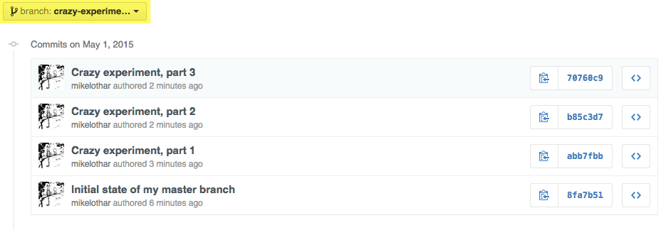
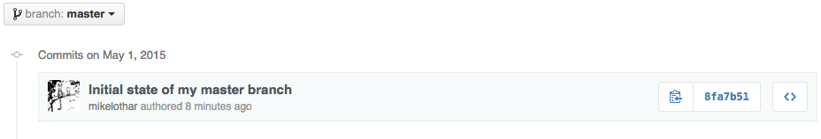
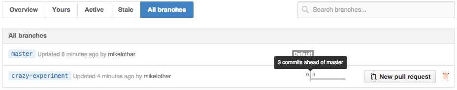

# GIT commands

#### Revert local changes
To reset all local changes, get the same content as remote master:

```bash
git fetch --all
git reset --hard origin/master
```

#### Staging files
Different ways to stage changed files, and why `git add -A` is preferred:

```bash
git add . (stages new and modified, without deleted)
git add -u (stages modified and deleted, without new)
git add -A (stages All)
```

To unstage files:

```bash
git reset (removes added)
```

#### Git config
Show content of .gitconfig:

```bash
git config --global --edit 
```

#### Rollback
Remove unwanted commits to origin/master, return state to how it looked like at commit id e3f1e37:

```bash
git reset --hard e3f1e37
git push --force origin master
```

#### Move your crazy experiment into a seperate branch
Let's assume you've been committing code for a crazy experiment to the master branch for a while, then realize this should have been in its own branch:


Create a seperate branch containing this experimental code:
```
git branch crazy-experiment
git push origin crazy-experiment
```


Reset master branch:
```
git reset --hard 8fa7b51
git push --force origin master
```


You can verify your experiment branch is 3 commits ahead of master:


Now continue working on your experimental branch:
```
git checkout crazy-experiment
```

#### Reset file
Overwrite content in file with content from same file located on origin/master:

```bash
git checkout origin/master -- <file>
```

#### Branch names 
Show a list of branches on origin:

```bash
git fetch origin
git branch -v -a
```

#### Ignore changes
To ignore local changes to a tracked file:

```bash
git update-index --assume-unchanged <file>
```

#### Un-ignore changes
To un-ignore local changes to a tracked file:

```bash
git update-index --no-assume-unchanged <file>
```

#### Misc

```bash
git config core.safecrlf false
```

#### GitHub
Create a new repository on the command line:
```bash
echo "# courses" >> README.md
git init
git add README.md
git commit -m "first commit"
git remote add origin https://github.com/mikelothar/[repo].git
git push -u origin master
```
…or push an existing repository from the command line:
```bash
git remote add origin https://github.com/mikelothar/[repo].git
git push -u origin master
```
